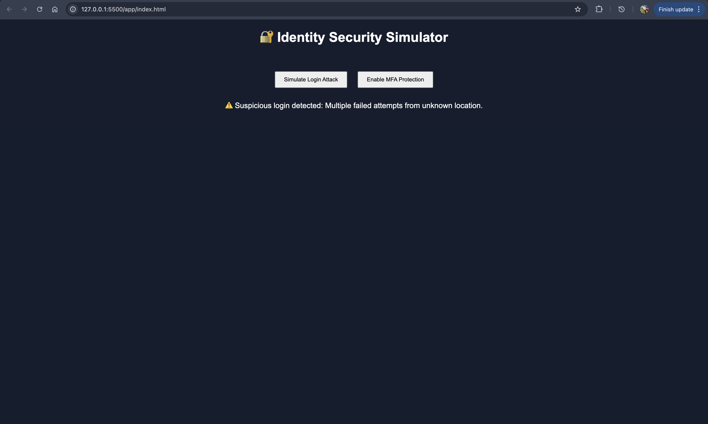
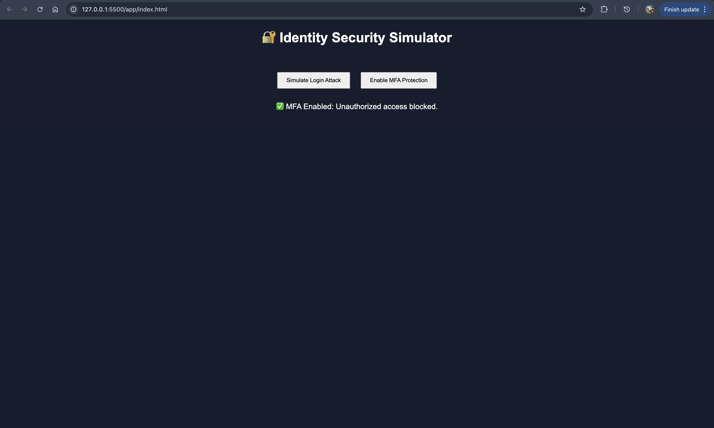

# 🔐 Enterprise Identity Security Simulator

## Overview
This project simulates identity-based attack scenarios and demonstrates how Multi-Factor Authentication (MFA) mitigates unauthorized access.

## What This Demonstrates
- Account compromise scenarios
- Suspicious login detection
- MFA enforcement as a security control
- Basic Zero Trust thinking

## Features
- Simulated login attack alert
- MFA protection response
- Interactive UI

## Real-World Context
Inspired by real support cases involving:
- Account takeovers
- Impersonation attempts
- Suspicious login behavior

## Tech Used
- HTML
- CSS
- JavaScript

## Screenshots

